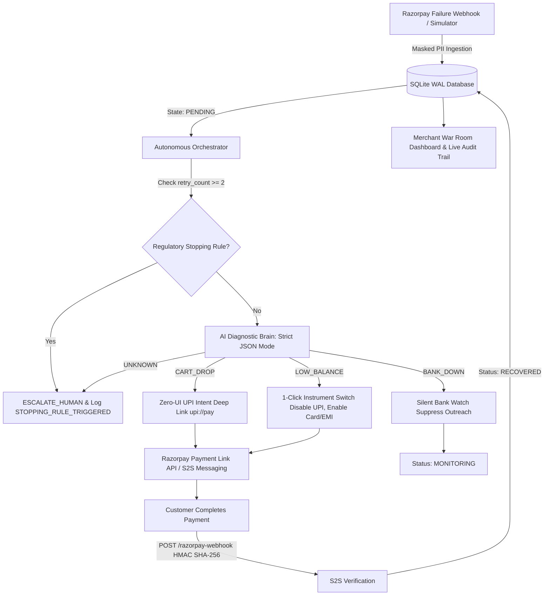

# 🛡️ Pratyavartan (प्रत्यावर्तन)
### Autonomous, Compliance-First AI Revenue Recovery Engine for Razorpay

[](https://fastapi.tiangolo.com)
[](https://nextjs.org)
[](https://razorpay.com)
[](https://huggingface.co/spaces/Nilesh67/Pratyavartan)
[](https://pratyavartan.vercel.app)
[](LICENSE)

<p align="center">
  <b>Recover 30%+ of dropped e-commerce revenue autonomously without breaking RBI compliance or annoying customers.</b>
</p>

[🌐 Live Landing Page](https://pratyavartan.vercel.app) • [⚡ Live Merchant War Room](https://nilesh67-pratyavartan.hf.space/dashboard) • [📚 API Documentation](https://nilesh67-pratyavartan.hf.space/docs)

</div>

---

## ⚡ The Problem: The ₹1.2 Lakh Crore Payment Leakage

In Indian e-commerce, **over 32% of transactions fail at the checkout edge**:
1. **UPI Limit & Insufficient Funds:** Customers get stuck on failing UPI rails with no easy way to switch without abandoning their carts.
2. **Bank Gateway Downtime:** Indiscriminate recovery bots blast customers with WhatsApp/SMS notifications while the acquiring bank is down, destroying brand trust.
3. **Harassment & Regulatory Risk:** Aggressive spam violates **RBI Digital Payment Directives**.
4. **Manual Merchant Escalations:** Support teams spend hours manually identifying failed payments instead of automating recovery.

---

## 💡 The Solution: Pratyavartan

**Pratyavartan (Sanskrit for *"Return / Reclamation"* )** is an autonomous revenue recovery engine built natively on top of the **Razorpay API ecosystem**. 

It listens to real-time payment failure streams, evaluates root causes with a strict-JSON AI diagnostic brain, dispatches self-healing payment channels (Zero-UI UPI Intent and 1-Click Instrument Switching), and logs every single autonomous decision into an **immutable, cryptographically chained audit ledger**.

---

## 🏗️ System Architecture



---

## 🚀 Autonomous Superpowers

### 1. 🎯 Dynamic 1-Click Instrument Switching (`SWITCH_INSTRUMENT`)
When an order fails due to insufficient balance or daily UPI caps:
- Automatically provisions a customized Razorpay Payment Link.
- **Disables failing payment rails** (`upi=0`, `wallet=0`).
- **Enforces backup rails** (`card=1`, `emi=1`, `netbanking=1`).
- Eliminates cart rebuild friction — customer completes checkout with 1 tap.

### 2. ⚡ Zero-UI UPI Deep Linking (`SEND_UPI_INTENT`)
For dropped carts and session timeouts:
- Creates direct `upi://pay` intent payloads.
- Applies intelligent tiered retention incentives (2% to 5% based on cart value).
- Launches customer's default UPI app (Google Pay, PhonePe, Paytm) directly.

### 3. 🤫 Silent Bank Health Watch (`WAIT_AND_MONITOR`)
When an acquiring bank goes down (`BANK_DOWN`):
- **Outreach is strictly suppressed** to protect merchant reputation.
- Shifts transaction to active monitoring queue.
- Re-evaluates payment state once banking rails recover.

### 4. 🛑 Hard Regulatory Stopping Rules (RBI Anti-Harassment Guardrails)
- If a customer transaction reaches `retry_count >= 2`, autonomous outreach immediately aborts.
- Emits a `STOPPING_RULE_TRIGGERED` event.
- Flags the transaction as `ESCALATED` to human support with full diagnostic history.

### 5. 🎙️ Hinglish AI Voice Recovery Engine
- Dynamically generates hyper-personalized audio outreach in natural Hinglish via `gTTS`.
- Explains the payment issue respectfully and shares one-click recovery instructions.

### 6. ⛓️ Cryptographic Hash-Chaining Audit Ledger
- Every log entry is cryptographically sealed with SHA-256 (`hash = SHA256(prev_hash + event_data)`).
- Provides non-repudiable proof of compliance for RBI/PCI-DSS audits.

---

## 🛠️ Tech Stack

| Layer | Technologies |
|---|---|
| **Backend Engine** | Python 3.11, FastAPI, Uvicorn, SQLite 3 (WAL Mode) |
| **AI Diagnostic Core** | OpenAI GPT-4o-mini / MiniMax via OpenRouter (Strict JSON Schema) |
| **Payment & Voice** | Razorpay Python SDK, HMAC SHA-256 Webhook Verification, gTTS |
| **Merchant War Room** | Bootstrap 5.3 Dark Glassmorphism, Google Fonts (*Outfit*, *Inter*), Real-time sync |
| **Landing Experience** | Next.js 16 (App Router), React 19, Tailwind CSS v4, Framer Motion, GSAP, Three.js |
| **Deployments** | Hugging Face Spaces (Backend Gradio SDK), Vercel (Frontend Landing) |

---

## 📂 Repository Structure

```text
├── main.py                  # FastAPI Application, Webhooks & Simulation Endpoints
├── db.py                    # SQLite WAL Database & Cryptographic Hash Chaining Ledger
├── ai_agent.py              # AI Diagnostic Classifier & Hinglish Voice Engine
├── orchestrator.py          # Autonomous Queue Engine & Stopping Rule Guardrails
├── razorpay_service.py      # Razorpay SDK Wrapper, UPI Intents & Link Generation
├── requirements.txt         # Core Backend Dependencies
├── templates/
│   └── index.html           # Merchant War Room & Live Audit Dashboard UI
├── revive-site/             # High-Performance Next.js 16 Landing Page
├── hf-gradio/               # Hugging Face Spaces Deployment Package
├── DEPLOY_HF.md             # HF Spaces Step-by-Step Deployment Guide
└── DEPLOY_VERCEL.md         # Vercel Landing Deployment Guide
```

---

## 💻 Local Setup & Development

### 1. Prerequisites
- Python 3.10+
- Node.js 18+ (for frontend)
- Razorpay Test Account (`Key ID` & `Key Secret`)

### 2. Backend Setup
```bash
# Clone the repository
git clone https://github.com/Nilesh1381/Pratyavartan.git
cd Pratyavartan

# Create and activate virtual environment
python -m venv venv
# Windows:
.\venv\Scripts\activate
# Linux/macOS:
source venv/bin/activate

# Install dependencies
pip install -r requirements.txt

# Configure Environment Variables (.env)
cp .env.example .env
```

Fill in your `.env` credentials:
```ini
RAZORPAY_KEY_ID=rzp_test_...
RAZORPAY_KEY_SECRET=...
RAZORPAY_WEBHOOK_SECRET=...
LLM_API_KEY=sk-or-v1-...
LLM_BASE_URL=https://openrouter.ai/api/v1
LLM_MODEL=minimax/minimax-01
DEMO_VPA=revive@upi
PORT=8010
```

Start the backend:
```bash
python main.py
```
- War Room Dashboard: `http://localhost:8010/dashboard`
- OpenAPI Docs: `http://localhost:8010/docs`

### 3. Frontend Landing Setup
```bash
cd revive-site
npm install
npm run dev
```
Visit `http://localhost:3000` to interact with the 3D animated landing page.

---

## 🧪 Interactive Jury Evaluation Cheat Sheet

The Merchant Command Center includes a built-in **Live Simulation Engine** so evaluators can test scenarios in real-time:

| Scenario Button | Simulated Failure | System Response |
|---|---|---|
| **Test UPI Limit** | `PAYMENT_UPI_LIMIT_EXCEEDED` | Switches instrument to Card/Netbanking, generates 1-click recovery link with zero discount. |
| **Test Dropped Cart** | `CHECKOUT_INCOMPLETE` | Triggers Zero-UI UPI intent deep link with dynamic tiered discount. |
| **Test Bank Down** | `GATEWAY_TIMEOUT` | Silently enters `MONITORING`, suppresses customer spam. |
| **Test Max Retries** | Payment with `retry_count >= 2` | Halts AI evaluation, logs `STOPPING_RULE_TRIGGERED`, triggers `ESCALATE_HUMAN`. |

---

## 🔒 Compliance & Security Guardrails

- **PII Masking:** Customer phone numbers are masked on ingestion (`******1234`), never stored raw in plaintext.
- **Cryptographic Webhooks:** All incoming webhooks must pass `X-Razorpay-Signature` HMAC SHA-256 validation.
- **Audit Immutability:** SQLite WAL mode with SHA-256 parent block hash chaining prevents log tampering.
- **No Harassment:** Strict limit of 2 retries per payment order.

---

## 👥 Authors & Acknowledgments

Built with ❤️ for the **Razorpay AI Buildathon 2026**.

- **Team**: Nilesh & Contributors
- **Repository**: [github.com/Nilesh1381/Pratyavartan](https://github.com/Nilesh1381/Pratyavartan)
- **Live Space**: [Hugging Face Space](https://huggingface.co/spaces/Nilesh67/Pratyavartan)
